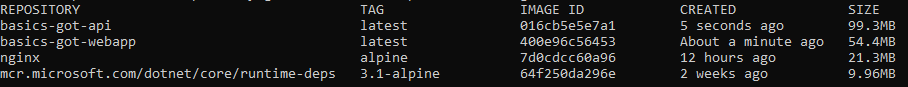

# Blazor WASM Application

The sample Blazor WASM (WebAssembly https://webassembly.org/) application, aims to demonstrate an client side application.

The sample use case, is the application lists all the Noble Houses in a dropdown. The user can then select any of the House to retrive information around the House.

For use case, an simple HTTP REST API has been created which serves as an data provider to the client application.


## Working

The MainLayout, aims in setting up an structure for the application. Here we can add the Header, Navigation Bar, Footer component place holders.

**MainLayout.razor**
```
@inherits LayoutComponentBase
    <div class="w3-container">
            @Body
    </div>

@code{
}
```

**Index.razor**

Displaying the list of Houses in an dropdown.
The value that is selected by the user is bind to the _selectedHouse variable.

The foreach loops over the Houses collection & adds option to the select input.

The button Get Details, when clicked an event is generated which is handled by HandleGet function.

```html
<div class="w3-row-padding">
    <div class="w3-col m3">
        <select class="w3-select w3-border" id="houses" @bind="_selectedHouse">
            <option>---Select House---</option>

            @foreach (var house in Houses)
            {
                <option value="@house.Id">@house.Name</option>
            }

        </select>
    </div>
    <div class="w3-col m1 w3-left ">
        <button class="w3-button w3-black w3-round-xxlarge" @onclick="HandleGet">Get Details</button>
    </div>
</div>
```

The below code gets executed on the pageload or Initialized event. 
Here HttpClient is used to make an http call to the API.

```csharp
protected override async Task OnInitializedAsync()
    {
        Houses = await HttpClient.GetFromJsonAsync<House[]>("house");
    }
```

The HandleGet is the event handler that handles the click even of the Get Details button. Here we retrive the selected value by the user which is bound to _selectedHouse.
The selected value is then used to make an Http call to retrive the House details.

```csharp
 private async Task HandleGet()
    {
        long houseid;

        if (long.TryParse(_selectedHouse, out houseid) == false)
        {
            return;
        }

        House = await HttpClient.GetFromJsonAsync<House>($"house/{houseid}");
    }
```

Once the House details are retrived and assigned to the variable, the below code helps in displaying the information.

```html
@if (House != null)
{
    <div class="w3-card-4">

        <header class="w3-container">
            <h1>@House.Name</h1>
        </header>

        <div class="w3-container">
            <div class="w3-row-padding">
                <div class="w3-col m2 ">
                    
                </div>
                <div class="w3-col m10" style="padding:10px;">
                    @House.Information
                </div>
            </div>
        </div>

    </div>
}
```

HTTPClient Injection

HTTP Client is configured & added to the Service collection so that it can be injected throughout the application. For current purpose, the base URL is set to point towards the API which provides data for the application.

```csharp
  builder.Services.AddTransient(sp => new HttpClient
            {
                BaseAddress = new Uri("http://localhost:5010/api/")
            });
```

Injecting the HTTP Client in pages.

```csharp
@inject HttpClient HttpClient
```

## Running/Developing the Application

Basics.GameOfThrones.Api

*Execute the http://localhost:5010/api/seed endpoint on the API URL, so that an In-Memory database can be seeded with information.*

```dotnetcli
dotnet run Basics.GameOfThrones.Api.csproj
```

Basics.GameOfThrones.BlazorWebApp

Note the watch switch, the watch monitors any changes made to any files, once the changes are saved, it automatically recompiles the application.

```dotnetcli
dotnet watch run Basics.GameOfThrones.BlazorWebApp.csproj
```

# Dockerizing 

## Publish Profiles

For Docker images, below publish profiles are used, docker image to build the project is not used.


### BlazorWebApp

Publish-Release, the published items will be saved in \publish\webapp folder.

```xml
<?xml version="1.0" encoding="utf-8"?>
<!--
https://go.microsoft.com/fwlink/?LinkID=208121. 
-->
<Project ToolsVersion="4.0" xmlns="http://schemas.microsoft.com/developer/msbuild/2003">
  <PropertyGroup>
    <DeleteExistingFiles>True</DeleteExistingFiles>
    <ExcludeApp_Data>False</ExcludeApp_Data>
    <LaunchSiteAfterPublish>True</LaunchSiteAfterPublish>
    <LastUsedBuildConfiguration>Release</LastUsedBuildConfiguration>
    <LastUsedPlatform>Any CPU</LastUsedPlatform>
    <PublishProvider>FileSystem</PublishProvider>
    <PublishUrl>..\publish\webapp</PublishUrl>
    <WebPublishMethod>FileSystem</WebPublishMethod>
    <SiteUrlToLaunchAfterPublish />
    <TargetFramework>netstandard2.1</TargetFramework>
    <ProjectGuid>4b380d47-7c05-4e5e-b5a4-b4c722dd8811</ProjectGuid>
  </PropertyGroup>
</Project>
```

### Api

Publish-Linux-Alpine, the published items will be saved in \publish\webapi folder.

```xml
<?xml version="1.0" encoding="utf-8"?>
<!--
https://go.microsoft.com/fwlink/?LinkID=208121. 
-->
<Project ToolsVersion="4.0" xmlns="http://schemas.microsoft.com/developer/msbuild/2003">
  <PropertyGroup>
    <DeleteExistingFiles>True</DeleteExistingFiles>
    <ExcludeApp_Data>False</ExcludeApp_Data>
    <LaunchSiteAfterPublish>True</LaunchSiteAfterPublish>
    <LastUsedBuildConfiguration>Release</LastUsedBuildConfiguration>
    <LastUsedPlatform>Any CPU</LastUsedPlatform>
    <PublishProvider>FileSystem</PublishProvider>
    <PublishUrl>..\publish\webapi</PublishUrl>
    <WebPublishMethod>FileSystem</WebPublishMethod>
    <SiteUrlToLaunchAfterPublish />
    <TargetFramework>netcoreapp3.1</TargetFramework>
    <RuntimeIdentifier>linux-musl-x64</RuntimeIdentifier>
    <PublishSingleFile>True</PublishSingleFile>
    <PublishTrimmed>True</PublishTrimmed>
    <ProjectGuid>bc6309d1-ef07-4dd5-9780-a748c860b1e1</ProjectGuid>
    <SelfContained>true</SelfContained>
  </PropertyGroup>
</Project>
```

Before making the docker images, publish both projects with the publish profiles.


## Docker Images

To run the applications in containers, Alpine Linux images are used. There would be two seperate images for the BlazorWebApp & Api




### BlazorWebApp

Since BlazorWebApp is an WebAssembly project hence it can run under any HTTP Server. There is no dependency on any .Net Core Runtime on the server. 

[Nginx](https://www.nginx.com/) is used for serving the application. The base docker image used is nginx:alpine which is an Alpine linux image with Nginx dependency. [Docker Hub](https://hub.docker.com/_/nginx)

**Dockerfile**

```dockerfile
# Specify the image that will be used
# This will be pulled from Docker Image Registry
FROM nginx:alpine
# Environment variable set for Blazor.
# The enviroment variable is used in nginx 
# configuration file to set up the headers.
ENV BLAZOR_ENVIRONMENT=Production
# Set the working directory in the image
WORKDIR /usr/share/nginx/html
# Copy the publish application to the workdir in image
COPY /publish/webapp/wwwroot ./
# Copy the nginx configuration file
COPY nginx.conf /etc/nginx/nginx.conf
# Copy the start script
COPY start.sh ./
# This command is optional, 
# it is just used to make sure all the EOL unix compliant
RUN sed -i -e "s/\r$//" start.sh
# The command that will be executed when the container starts
CMD /bin/sh ./start.sh
```
**Start Script**
```bash

#!/bin/sh

# The script replaces some values in the nginx configuration file
# based upon environment values set for the container
# After completion of the replacement it starts the nginx server.
# Often containers are hosted with port mappings with the host.
# This is will replace the placeholder with PORT value enviroment variable set in the 
# container in the nginx configuration file.
sed -i -E "s/TO_REPLACE_PORT/${PORT:-80}/" /etc/nginx/nginx.conf
# Below will replace the placeholder in the nginx congfiguration file
sed -i -e 's/TO_REPLACE_BLAZOR_ENVIRONMENT/'"$BLAZOR_ENVIRONMENT"'/g' /etc/nginx/nginx.conf 
# Start nginx service in the container
nginx -g 'daemon off;'

```

**nginx Configuration**

```nginx
events { }
http {
    include mime.types;

    types {
        application/wasm wasm;
    }

    server {
        # This defines the port that the server will bind to. Like 80 port
        listen TO_REPLACE_PORT;
        
        # This will add the environment http header to the responses
        add_header Blazor-Environment TO_REPLACE_BLAZOR_ENVIRONMENT;
        location / {
            root /usr/share/nginx/html;
            try_files $uri $uri/ /index.html =404;
        }
    }
}
```

### Docker Command

To create the docker image the following command is used.
This will build an image tag it as basics-got-webapp, and read docker config 
from Dockerfile.BlazorWebApp which is found in the current folder (.)

```bash
docker build --pull -t basics-got-webapp -f Dockerfile.BlazorWebApp .
```

To test the image that is created execute, this will run the container on external 5000 port, so it can be accesed http://localhost:5000

```bash
docker run --rm -it -p 5000:80 -e BLAZOR_ENVIRONMENT=Development --name webapp basics-got-webapp
```

## WebApi

**Dockerfile**

```dockerfile
# Specify the image that will be used
# This will be pulled from Docker Image Registry
FROM mcr.microsoft.com/dotnet/core/runtime-deps:3.1-alpine

# Set the working directory in the image
WORKDIR /app

# Copy the publish application to the workdir in image
COPY /publish/webapi ./

ENTRYPOINT ["./Basics.GameOfThrones.Api"]
```

### Docker Command

To create the docker image the following command is used.
This will build an image tag it as basics-got-api, and read docker config 
from Dockerfile.WebApi which is found in the current folder (.)

```bash
docker build --pull -t basics-got-api -f Dockerfile.WebApi .
```

To test the image that is created execute, this will run the container on external 5010 port, so it can be accesed http://localhost:5010

```bash
docker run --rm -it -p 5010:80 -e ASPNETCORE_ENVIRONMENT=Development --name webapi basics-got-api
```