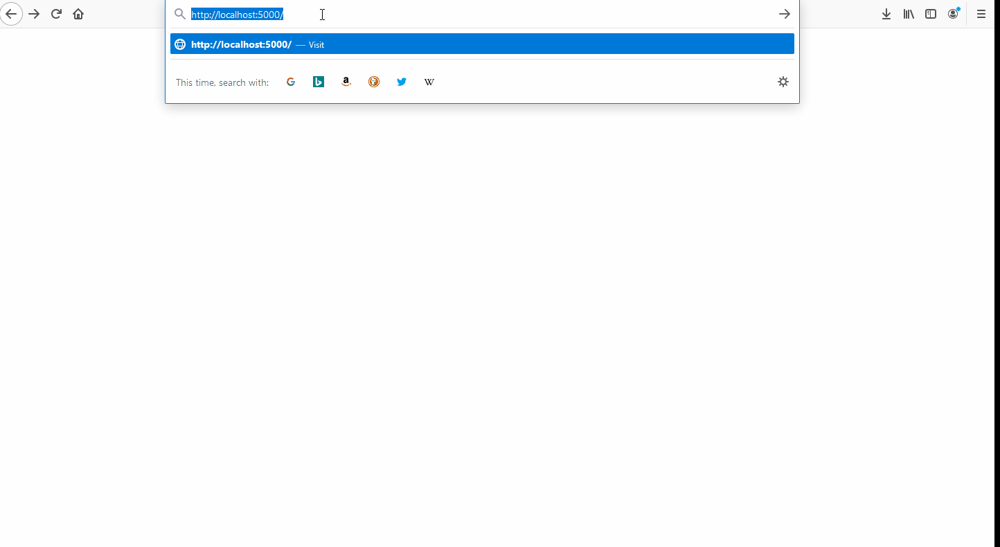

# Blazor WASM Application

The sample Blazor WASM (WebAssembly https://webassembly.org/) application, aims to demonstrate an client side application.

The sample use case, is the application lists all the Noble Houses in a dropdown. The user can then select any of the House to retrive information around the House.

For use case, an simple HTTP REST API has been created which serves as an data provider to the client application.





## Working

The MainLayout, aims in setting up an structure for the application. Here we can add the Header, Navigation Bar, Footer component place holders.

**MainLayout.razor**
```
@inherits LayoutComponentBase
    <div class="w3-container">
            @Body
    </div>

@code{
}
```

**Index.razor**

Displaying the list of Houses in an dropdown.
The value that is selected by the user is bind to the _selectedHouse variable.

The foreach loops over the Houses collection & adds option to the select input.

The button Get Details, when clicked an event is generated which is handled by HandleGet function.

```html
<div class="w3-row-padding">
    <div class="w3-col m3">
        <select class="w3-select w3-border" id="houses" @bind="_selectedHouse">
            <option>---Select House---</option>

            @foreach (var house in Houses)
            {
                <option value="@house.Id">@house.Name</option>
            }

        </select>
    </div>
    <div class="w3-col m1 w3-left ">
        <button class="w3-button w3-black w3-round-xxlarge" @onclick="HandleGet">Get Details</button>
    </div>
</div>
```

The below code gets executed on the pageload or Initialized event. 
Here HttpClient is used to make an http call to the API.

```csharp
protected override async Task OnInitializedAsync()
    {
        Houses = await HttpClient.GetFromJsonAsync<House[]>("house");
    }
```

The HandleGet is the event handler that handles the click even of the Get Details button. Here we retrive the selected value by the user which is bound to _selectedHouse.
The selected value is then used to make an Http call to retrive the House details.

```csharp
 private async Task HandleGet()
    {
        long houseid;

        if (long.TryParse(_selectedHouse, out houseid) == false)
        {
            return;
        }

        House = await HttpClient.GetFromJsonAsync<House>($"house/{houseid}");
    }
```

Once the House details are retrived and assigned to the variable, the below code helps in displaying the information.

```html
@if (House != null)
{
    <div class="w3-card-4">

        <header class="w3-container">
            <h1>@House.Name</h1>
        </header>

        <div class="w3-container">
            <div class="w3-row-padding">
                <div class="w3-col m2 ">
                    
                </div>
                <div class="w3-col m10" style="padding:10px;">
                    @House.Information
                </div>
            </div>
        </div>

    </div>
}
```

HTTPClient Injection

HTTP Client is configured & added to the Service collection so that it can be injected throughout the application. For current purpose, the base URL is set to point towards the API which provides data for the application.

```csharp
  builder.Services.AddTransient(sp => new HttpClient
            {
                BaseAddress = new Uri("http://localhost:5010/api/")
            });
```

Injecting the HTTP Client in pages.

```csharp
@inject HttpClient HttpClient
```

## Running/Developing the Application

Basics.GameOfThrones.Api

*Execute the http://localhost:5010/api/seed endpoint on the API URL, so that an In-Memory database can be seeded with information.*

```dotnetcli
dotnet run Basics.GameOfThrones.Api.csproj
```

Basics.GameOfThrones.BlazorWebApp

Note the watch switch, the watch monitors any changes made to any files, once the changes are saved, it automatically recompiles the application.

```dotnetcli
dotnet watch run Basics.GameOfThrones.BlazorWebApp.csproj
```